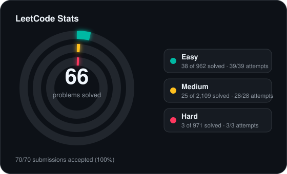
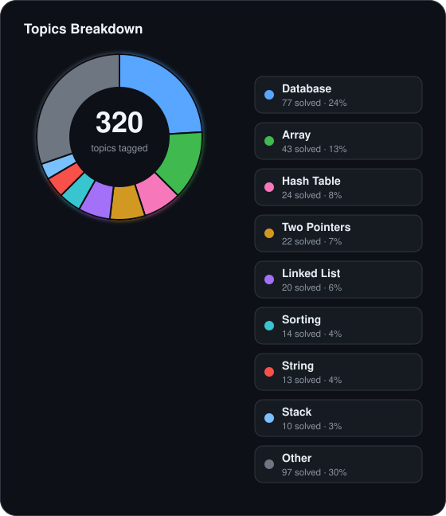

<!-- leetcode-stats:start -->
# LeetCode Solutions

Auto-synced by LeetCode to GitHub Sync.

<!-- leetcode-stats:end -->

| # | Title | Difficulty | Tags | Status |
| --- | --- | --- | --- | --- |
| 13 | [Roman to Integer](https://leetcode.com/problems/roman-to-integer/) | Easy | Hash Table, Math, String | ✅ Accepted |<!-- id:roman-to-integer -->
| 402 | [Remove K Digits](https://leetcode.com/problems/remove-k-digits/) | Medium | String, Stack, Greedy, Monotonic Stack | ✅ Accepted |<!-- id:remove-k-digits -->
| 451 | [Sort Characters By Frequency](https://leetcode.com/problems/sort-characters-by-frequency/) | Medium | Hash Table, String, Sorting, Heap (Priority Queue), Bucket Sort, Counting | ✅ Accepted |<!-- id:sort-characters-by-frequency -->
| 1 | [Two Sum](https://leetcode.com/problems/two-sum/) | Easy | Array, Hash Table | ✅ Accepted |<!-- id:two-sum -->
| 9 | [Palindrome Number](https://leetcode.com/problems/palindrome-number/) | Easy | Math | ✅ Accepted |<!-- id:palindrome-number -->
| 11 | [Container With Most Water](https://leetcode.com/problems/container-with-most-water/) | Medium | Array, Two Pointers, Greedy | ✅ Accepted |<!-- id:container-with-most-water -->
| 15 | [3Sum](https://leetcode.com/problems/3sum/) | Medium | Array, Two Pointers, Sorting | ✅ Accepted |<!-- id:3sum -->
| 175 | [Combine Two Tables](https://leetcode.com/problems/combine-two-tables/) | Easy | Database | ✅ Accepted |<!-- id:combine-two-tables -->
| 176 | [Second Highest Salary](https://leetcode.com/problems/second-highest-salary/) | Medium | Database | ✅ Accepted |<!-- id:second-highest-salary -->
| 177 | [Nth Highest Salary](https://leetcode.com/problems/nth-highest-salary/) | Medium | Database | ✅ Accepted |<!-- id:nth-highest-salary -->
| 178 | [Rank Scores](https://leetcode.com/problems/rank-scores/) | Medium | Database | ✅ Accepted |<!-- id:rank-scores -->
| 180 | [Consecutive Numbers](https://leetcode.com/problems/consecutive-numbers/) | Medium | Database | ✅ Accepted |<!-- id:consecutive-numbers -->
| 181 | [Employees Earning More Than Their Managers](https://leetcode.com/problems/employees-earning-more-than-their-managers/) | Easy | Database | ✅ Accepted |<!-- id:employees-earning-more-than-their-managers -->
| 182 | [Duplicate Emails](https://leetcode.com/problems/duplicate-emails/) | Easy | Database | ✅ Accepted |<!-- id:duplicate-emails -->
| 183 | [Customers Who Never Order](https://leetcode.com/problems/customers-who-never-order/) | Easy | Database | ✅ Accepted |<!-- id:customers-who-never-order -->
| 184 | [Department Highest Salary](https://leetcode.com/problems/department-highest-salary/) | Medium | Database | ✅ Accepted |<!-- id:department-highest-salary -->
| 185 | [Department Top Three Salaries](https://leetcode.com/problems/department-top-three-salaries/) | Hard | Database | ✅ Accepted |<!-- id:department-top-three-salaries -->
| 196 | [Delete Duplicate Emails](https://leetcode.com/problems/delete-duplicate-emails/) | Easy | Database | ✅ Accepted |<!-- id:delete-duplicate-emails -->
| 262 | [Trips and Users](https://leetcode.com/problems/trips-and-users/) | Hard | Database | ✅ Accepted |<!-- id:trips-and-users -->
| 511 | [Game Play Analysis I](https://leetcode.com/problems/game-play-analysis-i/) | Easy | Database | ✅ Accepted |<!-- id:game-play-analysis-i -->
| 197 | [Rising Temperature](https://leetcode.com/problems/rising-temperature/) | Easy | Database | ✅ Accepted |<!-- id:rising-temperature -->
| 595 | [Big Countries](https://leetcode.com/problems/big-countries/) | Easy | Database | ✅ Accepted |<!-- id:big-countries -->
| 550 | [Game Play Analysis IV](https://leetcode.com/problems/game-play-analysis-iv/) | Medium | Database | ✅ Accepted |<!-- id:game-play-analysis-iv -->
| 570 | [Managers with at Least 5 Direct Reports](https://leetcode.com/problems/managers-with-at-least-5-direct-reports/) | Medium | Database | ✅ Accepted |<!-- id:managers-with-at-least-5-direct-reports -->
| 577 | [Employee Bonus](https://leetcode.com/problems/employee-bonus/) | Easy | Database | ✅ Accepted |<!-- id:employee-bonus -->
| 584 | [Find Customer Referee](https://leetcode.com/problems/find-customer-referee/) | Easy | Database | ✅ Accepted |<!-- id:find-customer-referee -->
| 585 | [Investments in 2016](https://leetcode.com/problems/investments-in-2016/) | Medium | Database | ✅ Accepted |<!-- id:investments-in-2016 -->
| 586 | [Customer Placing the Largest Number of Orders](https://leetcode.com/problems/customer-placing-the-largest-number-of-orders/) | Easy | Database | ✅ Accepted |<!-- id:customer-placing-the-largest-number-of-orders -->
| 596 | [Classes With at Least 5 Students](https://leetcode.com/problems/classes-with-at-least-5-students/) | Easy | Database | ✅ Accepted |<!-- id:classes-with-at-least-5-students -->
| 601 | [Human Traffic of Stadium](https://leetcode.com/problems/human-traffic-of-stadium/) | Hard | Database | ✅ Accepted |<!-- id:human-traffic-of-stadium -->
| 602 | [Friend Requests II: Who Has the Most Friends](https://leetcode.com/problems/friend-requests-ii-who-has-the-most-friends/) | Medium | Database | ✅ Accepted |<!-- id:friend-requests-ii-who-has-the-most-friends -->
| 607 | [Sales Person](https://leetcode.com/problems/sales-person/) | Easy | Database | ✅ Accepted |<!-- id:sales-person -->
| 608 | [Tree Node](https://leetcode.com/problems/tree-node/) | Medium | Database | ✅ Accepted |<!-- id:tree-node -->
| 610 | [Triangle Judgement](https://leetcode.com/problems/triangle-judgement/) | Easy | Database | ✅ Accepted |<!-- id:triangle-judgement -->
| 619 | [Biggest Single Number](https://leetcode.com/problems/biggest-single-number/) | Easy | Database | ✅ Accepted |<!-- id:biggest-single-number -->
| 620 | [Not Boring Movies](https://leetcode.com/problems/not-boring-movies/) | Easy | Database | ✅ Accepted |<!-- id:not-boring-movies -->
| 626 | [Exchange Seats](https://leetcode.com/problems/exchange-seats/) | Medium | Database | ✅ Accepted |<!-- id:exchange-seats -->
| 627 | [Swap Sex of Employees](https://leetcode.com/problems/swap-sex-of-employees/) | Easy | Database | ✅ Accepted |<!-- id:swap-sex-of-employees -->
| 1045 | [Customers Who Bought All Products](https://leetcode.com/problems/customers-who-bought-all-products/) | Medium | Database | ✅ Accepted |<!-- id:customers-who-bought-all-products -->
| 1050 | [Actors and Directors Who Cooperated At Least Three Times](https://leetcode.com/problems/actors-and-directors-who-cooperated-at-least-three-times/) | Easy | Database | ✅ Accepted |<!-- id:actors-and-directors-who-cooperated-at-least-three-times -->
| 1068 | [Product Sales Analysis I](https://leetcode.com/problems/product-sales-analysis-i/) | Easy | Database | ✅ Accepted |<!-- id:product-sales-analysis-i -->
| 1070 | [Product Sales Analysis III](https://leetcode.com/problems/product-sales-analysis-iii/) | Medium | Database | ✅ Accepted |<!-- id:product-sales-analysis-iii -->
| 1075 | [Project Employees I](https://leetcode.com/problems/project-employees-i/) | Easy | Database | ✅ Accepted |<!-- id:project-employees-i -->
| 1141 | [User Activity for the Past 30 Days I](https://leetcode.com/problems/user-activity-for-the-past-30-days-i/) | Easy | Database | ✅ Accepted |<!-- id:user-activity-for-the-past-30-days-i -->
| 1148 | [Article Views I](https://leetcode.com/problems/article-views-i/) | Easy | Database | ✅ Accepted |<!-- id:article-views-i -->
| 1158 | [Market Analysis I](https://leetcode.com/problems/market-analysis-i/) | Medium | Database | ✅ Accepted |<!-- id:market-analysis-i -->
| 1164 | [Product Price at a Given Date](https://leetcode.com/problems/product-price-at-a-given-date/) | Medium | Database | ✅ Accepted |<!-- id:product-price-at-a-given-date -->
| 1174 | [Immediate Food Delivery II](https://leetcode.com/problems/immediate-food-delivery-ii/) | Medium | Database | ✅ Accepted |<!-- id:immediate-food-delivery-ii -->
| 1179 | [Reformat Department Table](https://leetcode.com/problems/reformat-department-table/) | Easy | Database | ✅ Accepted |<!-- id:reformat-department-table -->
| 1193 | [Monthly Transactions I](https://leetcode.com/problems/monthly-transactions-i/) | Medium | Database | ✅ Accepted |<!-- id:monthly-transactions-i -->
| 1084 | [Sales Analysis III](https://leetcode.com/problems/sales-analysis-iii/) | Easy | Database | ✅ Accepted |<!-- id:sales-analysis-iii -->
| 1204 | [Last Person to Fit in the Bus](https://leetcode.com/problems/last-person-to-fit-in-the-bus/) | Medium | Database | ✅ Accepted |<!-- id:last-person-to-fit-in-the-bus -->
| 1211 | [Queries Quality and Percentage](https://leetcode.com/problems/queries-quality-and-percentage/) | Easy | Database | ✅ Accepted |<!-- id:queries-quality-and-percentage -->
| 1280 | [Students and Examinations](https://leetcode.com/problems/students-and-examinations/) | Easy | Database | ✅ Accepted |<!-- id:students-and-examinations -->
| 1321 | [Restaurant Growth](https://leetcode.com/problems/restaurant-growth/) | Medium | Database | ✅ Accepted |<!-- id:restaurant-growth -->
| 1327 | [List the Products Ordered in a Period](https://leetcode.com/problems/list-the-products-ordered-in-a-period/) | Easy | Database | ✅ Accepted |<!-- id:list-the-products-ordered-in-a-period -->
| 1341 | [Movie Rating](https://leetcode.com/problems/movie-rating/) | Medium | Database | ✅ Accepted |<!-- id:movie-rating -->
| 1378 | [Replace Employee ID With The Unique Identifier](https://leetcode.com/problems/replace-employee-id-with-the-unique-identifier/) | Easy | Database | ✅ Accepted |<!-- id:replace-employee-id-with-the-unique-identifier -->
| 1393 | [Capital Gain/Loss](https://leetcode.com/problems/capital-gainloss/) | Medium | Database | ✅ Accepted |<!-- id:capital-gainloss -->
| 1407 | [Top Travellers](https://leetcode.com/problems/top-travellers/) | Easy | Database | ✅ Accepted |<!-- id:top-travellers -->
| 1484 | [Group Sold Products By The Date](https://leetcode.com/problems/group-sold-products-by-the-date/) | Easy | Database | ✅ Accepted |<!-- id:group-sold-products-by-the-date -->
| 1527 | [Patients With a Condition](https://leetcode.com/problems/patients-with-a-condition/) | Easy | Database | ✅ Accepted |<!-- id:patients-with-a-condition -->
| 1587 | [Bank Account Summary II](https://leetcode.com/problems/bank-account-summary-ii/) | Easy | Database | ✅ Accepted |<!-- id:bank-account-summary-ii -->
| 1633 | [Percentage of Users Attended a Contest](https://leetcode.com/problems/percentage-of-users-attended-a-contest/) | Easy | Database | ✅ Accepted |<!-- id:percentage-of-users-attended-a-contest -->
| 1661 | [Average Time of Process per Machine](https://leetcode.com/problems/average-time-of-process-per-machine/) | Easy | Database | ✅ Accepted |<!-- id:average-time-of-process-per-machine -->
| 1667 | [Fix Names in a Table](https://leetcode.com/problems/fix-names-in-a-table/) | Easy | Database | ✅ Accepted |<!-- id:fix-names-in-a-table -->
| 1683 | [Invalid Tweets](https://leetcode.com/problems/invalid-tweets/) | Easy | Database | ✅ Accepted |<!-- id:invalid-tweets -->
| 1693 | [Daily Leads and Partners](https://leetcode.com/problems/daily-leads-and-partners/) | Easy | Database | ✅ Accepted |<!-- id:daily-leads-and-partners -->
| 1729 | [Find Followers Count](https://leetcode.com/problems/find-followers-count/) | Easy | Database | ✅ Accepted |<!-- id:find-followers-count -->
| 1731 | [The Number of Employees Which Report to Each Employee](https://leetcode.com/problems/the-number-of-employees-which-report-to-each-employee/) | Easy | Database | ✅ Accepted |<!-- id:the-number-of-employees-which-report-to-each-employee -->
| 1581 | [Customer Who Visited but Did Not Make Any Transactions](https://leetcode.com/problems/customer-who-visited-but-did-not-make-any-transactions/) | Easy | Database | ✅ Accepted |<!-- id:customer-who-visited-but-did-not-make-any-transactions -->
| 2356 | [Number of Unique Subjects Taught by Each Teacher](https://leetcode.com/problems/number-of-unique-subjects-taught-by-each-teacher/) | Easy | Database | ✅ Accepted |<!-- id:number-of-unique-subjects-taught-by-each-teacher -->
| 1965 | [Employees With Missing Information](https://leetcode.com/problems/employees-with-missing-information/) | Easy | Database | ✅ Accepted |<!-- id:employees-with-missing-information -->
| 1934 | [Confirmation Rate](https://leetcode.com/problems/confirmation-rate/) | Medium | Database | ✅ Accepted |<!-- id:confirmation-rate -->
| 1907 | [Count Salary Categories](https://leetcode.com/problems/count-salary-categories/) | Medium | Database | ✅ Accepted |<!-- id:count-salary-categories -->
| 1890 | [The Latest Login in 2020](https://leetcode.com/problems/the-latest-login-in-2020/) | Easy | Database | ✅ Accepted |<!-- id:the-latest-login-in-2020 -->
| 1873 | [Calculate Special Bonus](https://leetcode.com/problems/calculate-special-bonus/) | Easy | Database | ✅ Accepted |<!-- id:calculate-special-bonus -->
| 1795 | [Rearrange Products Table](https://leetcode.com/problems/rearrange-products-table/) | Easy | Database | ✅ Accepted |<!-- id:rearrange-products-table -->
| 1789 | [Primary Department for Each Employee](https://leetcode.com/problems/primary-department-for-each-employee/) | Easy | Database | ✅ Accepted |<!-- id:primary-department-for-each-employee -->
| 1757 | [Recyclable and Low Fat Products](https://leetcode.com/problems/recyclable-and-low-fat-products/) | Easy | Database | ✅ Accepted |<!-- id:recyclable-and-low-fat-products -->
| 1741 | [Find Total Time Spent by Each Employee](https://leetcode.com/problems/find-total-time-spent-by-each-employee/) | Easy | Database | ✅ Accepted |<!-- id:find-total-time-spent-by-each-employee -->
| 1978 | [Employees Whose Manager Left the Company](https://leetcode.com/problems/employees-whose-manager-left-the-company/) | Easy | Database | ✅ Accepted |<!-- id:employees-whose-manager-left-the-company -->
| 1517 | [Find Users With Valid E-Mails](https://leetcode.com/problems/find-users-with-valid-e-mails/) | Easy | Database | ✅ Accepted |<!-- id:find-users-with-valid-e-mails -->
| 1251 | [Average Selling Price](https://leetcode.com/problems/average-selling-price/) | Easy | Database | ✅ Accepted |<!-- id:average-selling-price -->
| 485 | [Max Consecutive Ones](https://leetcode.com/problems/max-consecutive-ones/) | Easy | Array | ✅ Accepted |<!-- id:max-consecutive-ones -->
| 1295 | [Find Numbers with Even Number of Digits](https://leetcode.com/problems/find-numbers-with-even-number-of-digits/) | Easy | Array, Math | ✅ Accepted |<!-- id:find-numbers-with-even-number-of-digits -->
| 977 | [Squares of a Sorted Array](https://leetcode.com/problems/squares-of-a-sorted-array/) | Easy | Array, Two Pointers, Sorting | ✅ Accepted |<!-- id:squares-of-a-sorted-array -->
| 1089 | [Duplicate Zeros](https://leetcode.com/problems/duplicate-zeros/) | Easy | Array, Two Pointers | ✅ Accepted |<!-- id:duplicate-zeros -->
| 88 | [Merge Sorted Array](https://leetcode.com/problems/merge-sorted-array/) | Easy | Array, Two Pointers, Sorting | ✅ Accepted |<!-- id:merge-sorted-array -->
| 27 | [Remove Element](https://leetcode.com/problems/remove-element/) | Easy | Array, Two Pointers | ✅ Accepted |<!-- id:remove-element -->
| 26 | [Remove Duplicates from Sorted Array](https://leetcode.com/problems/remove-duplicates-from-sorted-array/) | Easy | Array, Two Pointers | ✅ Accepted |<!-- id:remove-duplicates-from-sorted-array -->
| 1346 | [Check If N and Its Double Exist](https://leetcode.com/problems/check-if-n-and-its-double-exist/) | Easy | Array, Hash Table, Two Pointers, Binary Search, Sorting | ✅ Accepted |<!-- id:check-if-n-and-its-double-exist -->
| 941 | [Valid Mountain Array](https://leetcode.com/problems/valid-mountain-array/) | Easy | Array | ✅ Accepted |<!-- id:valid-mountain-array -->
| 1299 | [Replace Elements with Greatest Element on Right Side](https://leetcode.com/problems/replace-elements-with-greatest-element-on-right-side/) | Easy | Array | ✅ Accepted |<!-- id:replace-elements-with-greatest-element-on-right-side -->
| 283 | [Move Zeroes](https://leetcode.com/problems/move-zeroes/) | Easy | Array, Two Pointers | ✅ Accepted |<!-- id:move-zeroes -->
| 905 | [Sort Array By Parity](https://leetcode.com/problems/sort-array-by-parity/) | Easy | Array, Two Pointers, Sorting | ✅ Accepted |<!-- id:sort-array-by-parity -->
| 1051 | [Height Checker](https://leetcode.com/problems/height-checker/) | Easy | Array, Sorting, Counting Sort, Bubble Sort | ✅ Accepted |<!-- id:height-checker -->
| 414 | [Third Maximum Number](https://leetcode.com/problems/third-maximum-number/) | Easy | Array, Sorting | ✅ Accepted |<!-- id:third-maximum-number -->
| 448 | [Find All Numbers Disappeared in an Array](https://leetcode.com/problems/find-all-numbers-disappeared-in-an-array/) | Easy | Array, Hash Table | ✅ Accepted |<!-- id:find-all-numbers-disappeared-in-an-array -->
| 2956 | [Find Common Elements Between Two Arrays](https://leetcode.com/problems/find-common-elements-between-two-arrays/) | Easy | Array, Hash Table | ✅ Accepted |<!-- id:find-common-elements-between-two-arrays -->
| 2574 | [Left and Right Sum Differences](https://leetcode.com/problems/left-and-right-sum-differences/) | Easy | Array, Prefix Sum | ✅ Accepted |<!-- id:left-and-right-sum-differences -->
| 3159 | [Find Occurrences of an Element in an Array](https://leetcode.com/problems/find-occurrences-of-an-element-in-an-array/) | Medium | Array, Hash Table | ✅ Accepted |<!-- id:find-occurrences-of-an-element-in-an-array -->
| 2215 | [Find the Difference of Two Arrays](https://leetcode.com/problems/find-the-difference-of-two-arrays/) | Easy | Array, Hash Table | ✅ Accepted |<!-- id:find-the-difference-of-two-arrays -->
| 1603 | [Design Parking System](https://leetcode.com/problems/design-parking-system/) | Easy | Design, Simulation, Counting | ✅ Accepted |<!-- id:design-parking-system -->
| 155 | [Min Stack](https://leetcode.com/problems/min-stack/) | Medium | Stack, Design | ✅ Accepted |<!-- id:min-stack -->
| 232 | [Implement Queue using Stacks](https://leetcode.com/problems/implement-queue-using-stacks/) | Easy | Stack, Design, Queue | ✅ Accepted |<!-- id:implement-queue-using-stacks -->
| 206 | [Reverse Linked List](https://leetcode.com/problems/reverse-linked-list/) | Easy | Linked List, Recursion | ✅ Accepted |<!-- id:reverse-linked-list -->
| 876 | [Middle of the Linked List](https://leetcode.com/problems/middle-of-the-linked-list/) | Easy | Linked List, Two Pointers | ✅ Accepted |<!-- id:middle-of-the-linked-list -->
| 234 | [Palindrome Linked List](https://leetcode.com/problems/palindrome-linked-list/) | Easy | Linked List, Two Pointers, Stack, Recursion | ✅ Accepted |<!-- id:palindrome-linked-list -->
| 20 | [Valid Parentheses](https://leetcode.com/problems/valid-parentheses/) | Easy | String, Stack, Bracket Sequences | ✅ Accepted |<!-- id:valid-parentheses -->
| 53 | [Maximum Subarray](https://leetcode.com/problems/maximum-subarray/) | Medium | Array, Divide and Conquer, Dynamic Programming | ✅ Accepted |<!-- id:maximum-subarray -->
| 104 | [Maximum Depth of Binary Tree](https://leetcode.com/problems/maximum-depth-of-binary-tree/) | Easy | Tree, Depth-First Search, Breadth-First Search, Binary Tree | ✅ Accepted |<!-- id:maximum-depth-of-binary-tree -->
| 100 | [Same Tree](https://leetcode.com/problems/same-tree/) | Easy | Tree, Depth-First Search, Breadth-First Search, Binary Tree | ✅ Accepted |<!-- id:same-tree -->
| 202 | [Happy Number](https://leetcode.com/problems/happy-number/) | Easy | Hash Table, Math, Two Pointers, Floyd's Cycle Finding Algorithm | ✅ Accepted |<!-- id:happy-number -->
| 355 | [Design Twitter](https://leetcode.com/problems/design-twitter/) | Medium | Hash Table, Linked List, Design, Heap (Priority Queue) | ✅ Accepted |<!-- id:design-twitter -->
| 21 | [Merge Two Sorted Lists](https://leetcode.com/problems/merge-two-sorted-lists/) | Easy | Linked List, Recursion | ✅ Accepted |<!-- id:merge-two-sorted-lists -->
| 19 | [Remove Nth Node From End of List](https://leetcode.com/problems/remove-nth-node-from-end-of-list/) | Medium | Linked List, Two Pointers | ✅ Accepted |<!-- id:remove-nth-node-from-end-of-list -->
| 142 | [Linked List Cycle II](https://leetcode.com/problems/linked-list-cycle-ii/) | Medium | Hash Table, Linked List, Two Pointers, Floyd's Cycle Finding Algorithm | ✅ Accepted |<!-- id:linked-list-cycle-ii -->
| 25 | [Reverse Nodes in k-Group](https://leetcode.com/problems/reverse-nodes-in-k-group/) | Hard | Linked List, Recursion | ✅ Accepted |<!-- id:reverse-nodes-in-k-group -->
| 58 | [Length of Last Word](https://leetcode.com/problems/length-of-last-word/) | Easy | String | ✅ Accepted |<!-- id:length-of-last-word -->
| 66 | [Plus One](https://leetcode.com/problems/plus-one/) | Easy | Array, Math | ✅ Accepted |<!-- id:plus-one -->
| 933 | [Number of Recent Calls](https://leetcode.com/problems/number-of-recent-calls/) | Easy | Design, Queue, Data Stream | ✅ Accepted |<!-- id:number-of-recent-calls -->
| 225 | [Implement Stack using Queues](https://leetcode.com/problems/implement-stack-using-queues/) | Easy | Stack, Design, Queue | ✅ Accepted |<!-- id:implement-stack-using-queues -->
| 622 | [Design Circular Queue](https://leetcode.com/problems/design-circular-queue/) | Medium | Array, Linked List, Design, Queue | ✅ Accepted |<!-- id:design-circular-queue -->
| 994 | [Rotting Oranges](https://leetcode.com/problems/rotting-oranges/) | Medium | Array, Breadth-First Search, Matrix | ✅ Accepted |<!-- id:rotting-oranges -->
| 101 | [Symmetric Tree](https://leetcode.com/problems/symmetric-tree/) | Easy | Tree, Depth-First Search, Breadth-First Search, Binary Tree | ✅ Accepted |<!-- id:symmetric-tree -->
| 110 | [Balanced Binary Tree](https://leetcode.com/problems/balanced-binary-tree/) | Easy | Tree, Depth-First Search, Binary Tree | ✅ Accepted |<!-- id:balanced-binary-tree -->
| 617 | [Merge Two Binary Trees](https://leetcode.com/problems/merge-two-binary-trees/) | Easy | Tree, Depth-First Search, Breadth-First Search, Binary Tree | ✅ Accepted |<!-- id:merge-two-binary-trees -->
| 1441 | [Build an Array With Stack Operations](https://leetcode.com/problems/build-an-array-with-stack-operations/) | Medium | Array, Stack, Simulation | ✅ Accepted |<!-- id:build-an-array-with-stack-operations -->
| 946 | [Validate Stack Sequences](https://leetcode.com/problems/validate-stack-sequences/) | Medium | Array, Stack, Simulation | ✅ Accepted |<!-- id:validate-stack-sequences -->
| 895 | [Maximum Frequency Stack](https://leetcode.com/problems/maximum-frequency-stack/) | Hard | Hash Table, Stack, Design, Ordered Set | ✅ Accepted |<!-- id:maximum-frequency-stack -->
| 239 | [Sliding Window Maximum](https://leetcode.com/problems/sliding-window-maximum/) | Hard | Array, Queue, Sliding Window, Heap (Priority Queue), Monotonic Queue, Range Minimum/Maximum Query | ✅ Accepted |<!-- id:sliding-window-maximum -->
| 124 | [Binary Tree Maximum Path Sum](https://leetcode.com/problems/binary-tree-maximum-path-sum/) | Hard | Dynamic Programming, Tree, Depth-First Search, Binary Tree, DP on Trees | ✅ Accepted |<!-- id:binary-tree-maximum-path-sum -->

